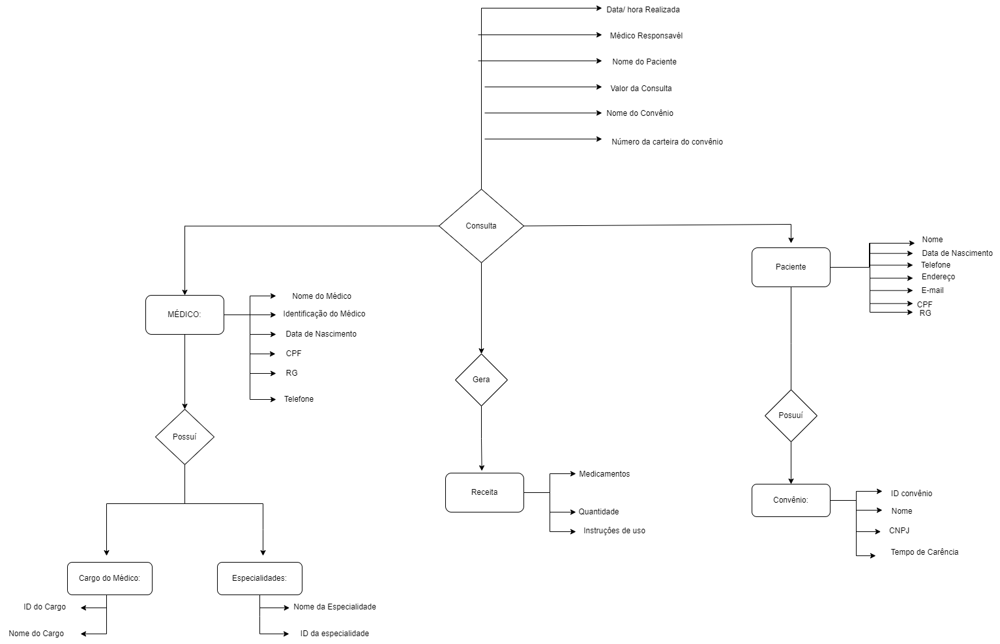
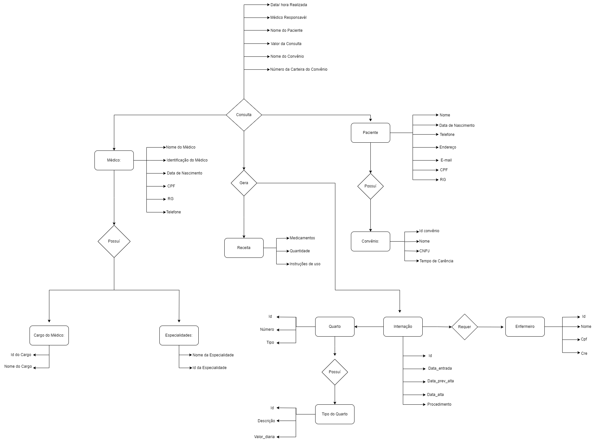

# Hospital - Banco de Dados
Projeto de criação de um banco de dados para gerenciar informações de um hospital.
# O Hospital Fundamental

Um pequeno hospital local busca desenvolver um novo sistema que atenda melhor às suas necessidades. Atualmente, parte da operação ainda se apoia em planilhas e arquivos antigos, mas espera-se que esses dados sejam transferidos para o novo sistema assim que ele estiver funcional. Neste momento, é necessário analisar com cuidado as necessidades desse cliente e sugerir uma estrutura de banco de dados adequada por meio de um Diagrama Entidade-Relacionamento.

Analise a seguinte descrição e extraia dela os requisitos para o banco de dados:
O hospital necessita de um sistema para sua área clínica que ajude a controlar consultas realizadas. Os médicos podem ser generalistas, especialistas ou residentes e têm seus dados pessoais cadastrados em planilhas digitais. Cada médico pode ter uma ou mais especialidades, que podem ser pediatria, clínica geral, gastroenterologia e dermatologia. Alguns registros antigos ainda estão em formulário de papel, mas será necessário incluir esses dados no novo sistema.

Os pacientes também precisam de cadastro, contendo dados pessoais (nome, data de nascimento, endereço, telefone e e-mail), documentos (CPF e RG) e convênio. Para cada convênio, são registrados nome, CNPJ e tempo de carência.

As consultas também têm sido registradas em planilhas, com data e hora de realização, médico responsável, paciente, valor da consulta ou nome do convênio, com o número da carteira. Também é necessário indicar na consulta qual a especialidade buscada pelo paciente.

Deseja-se ainda informatizar a receita do médico, de maneira que, no encerramento da consulta, ele possa registrar os medicamentos receitados, a quantidade e as instruções de uso. A partir disso, espera-se que o sistema imprima um relatório da receita ao paciente ou permita sua visualização via internet.

#
 # Os Segredos do Hospital (Parte 2)

Após a primeira versão do projeto de banco de dados para o sistema hospitalar, notou-se a necessidade de expansão das funcionalidades, incluindo alguns requisitos essenciais a essa versão do software. As funcionalidades em questão são para o controle na internação de pacientes.

No hospital, as internações têm sido registradas por meio de formulários eletrônicos que gravam os dados em arquivos. 

Para cada internação, são anotadas a data de entrada, a data prevista de alta e a data efetiva de alta, além da descrição textual dos procedimentos a serem realizados. 

As internações precisam ser vinculadas a quartos, com a numeração e o tipo. 

Cada tipo de quarto tem sua descrição e o seu valor diário (a princípio, o hospital trabalha com apartamentos, quartos duplos e enfermaria).

Também é necessário controlar quais profissionais de enfermaria estarão responsáveis por acompanhar o paciente durante sua internação. Para cada enfermeiro(a), é necessário nome, CPF e registro no conselho de enfermagem (CRE).

#
 # O Prisioneiro dos Dados  (Parte 3)

Inclua ao menos dez médicos de diferentes especialidades.

Ao menos sete especialidades (considere a afirmação de que “entre as especialidades há pediatria, clínica geral, gastrenterologia e dermatologia”).

Inclua ao menos 15 pacientes.

Registre 20 consultas de diferentes pacientes e diferentes médicos (alguns pacientes realizam mais que uma consulta). As consultas devem ter ocorrido entre 01/01/2015 e 01/01/2022. Ao menos dez consultas devem ter receituário com dois ou mais medicamentos.

Inclua ao menos quatro convênios médicos, associe ao menos cinco pacientes e cinco consultas.

Criar entidade de relacionamento entre médico e especialidade. 

Criar Entidade de Relacionamento entre internação e enfermeiro. 

Arrumar a chave estrangeira do relacionamento entre convênio e médico.

Criar entidade entre internação e enfermeiro.

Colocar chaves estrangeira dentro da internação (Chaves Médico e Paciente).

Registre ao menos sete internações. Pelo menos dois pacientes devem ter se internado mais de uma vez. Ao menos três quartos devem ser cadastrados. As internações devem ter ocorrido entre 01/01/2015 e 01/01/2022.

Considerando que “a princípio o hospital trabalha com apartamentos, quartos duplos e enfermaria”, inclua ao menos esses três tipos com valores diferentes.

Inclua dados de dez profissionais de enfermaria. Associe cada internação a ao menos dois enfermeiros.

Os dados de tipo de quarto, convênio e especialidade são essenciais para a operação do sistema e, portanto, devem ser povoados assim que o sistema for instalado.

#
 # A Ordem do Alterar  (Parte 4)
 
Crie um script que adicione uma coluna “em_atividade” para os médicos, indicando se ele ainda está atuando no hospital ou não. 

Crie um script para atualizar ao menos dois médicos como inativos e os demais em atividade.

-- Adicionar coluna "em_atividade" na tabela de médicos 
ALTER TABLE medicos ADD COLUMN em_atividade VARCHAR(20); 

-- Atualizar o status dos médicos como "ativo" ou "inativo" 
UPDATE medicos SET em_atividade = 'ativo' WHERE tipo_medico_id = 2; 
UPDATE medicos SET em_atividade = 'inativo' WHERE tipo_medico_id = 1; 
UPDATE medicos SET em_atividade = 'ativo' WHERE tipo_medico_id = 3; 

-- Selecionar todos os registros da tabela tipo_medico 
SELECT * FROM tipo_medico;

#
 # As Relíquias dos Dados (Parte 5)

Crie um script e nele inclua consultas que retornem:

1. Todos os dados e o valor médio das consultas do ano de 2020 e das que foram feitas sob convênio.
SELECT *  
FROM consultas 
WHERE YEAR(data_consulta) = 2020 
OR convenio = 'Sim'; 
SELECT AVG(valor_consulta) AS valor_medio 
FROM consultas 
WHERE YEAR(data_consulta) = 2020 
OR convenio = 'Sim'; 
   
2. Todos os dados das internações que tiveram data de alta maior que a data prevista para a alta.   
SELECT **  
FROM internacoes*  
WHERE data_alta > data_prevista_alta;* 

3. Receituário completo da primeira consulta registrada com receituário associado.
SELECT * 
FROM receituarios 
WHERE consulta_id = ( 
SELECT MIN(id) 
FROM consultas 
WHERE consulta_id IS NOT NULL
)

4. Todos os dados da consulta de maior valor e também da de menor valor (ambas as consultas não foram realizadas sob convênio). 
SELECT consulta.*, MAX(consulta.valor_consulta) AS max_valor_consulta, MIN(consulta.valor_consulta) AS min_valor_consulta  
FROM consulta  
INNER JOIN paciente ON consulta.paciente_id = paciente.id  
WHERE paciente.convenio_id IS NULL  
GROUP BY consulta.id;

5. Todos os dados das internações em seus respectivos quartos, calculando o total da internação a partir do valor de diária do quarto e o número de dias entre a entrada e a alta. 
SELECT internacoes.*, quartos.valor_diaria, DATEDIFF(internacoes.data_alta, internacoes.data_entrada) AS dias_internacao, quartos.valor_diaria * DATEDIFF(internacoes.data_alta, internacoes.data_entrada) AS total_internacao 
FROM internacoes 
JOIN quartos ON internacoes.quarto_id = quartos.id 

6. Data, procedimento e número de quarto de internações em quartos do tipo “apartamento”. 
select internacao.id, internacao.data_entrada, internacao.descricao_procedimento, quarto.numero  
from internacao 
inner join quarto  
on quarto.id = internacao.quarto_id where quarto.id = 1; 

7. Nome do paciente, data da consulta e especialidade de todas as consultas em que os pacientes eram menores de 18 anos na data da consulta e cuja especialidade não seja “pediatria”, ordenando por data de realização da consulta. 
SELECT consultas.nome_paciente, consultas.data_consulta, consultas.especialidade 
FROM consultas 
WHERE DATEDIFF(NOW(), consultas.data_nascimento_paciente) < 6570 -- Menor de 18 anos (6570 dias )
AND consultas.especialidade != 'pediatria' 
ORDER BY consultas.data_consulta; 

8. Nome do paciente, nome do médico, data da internação e procedimentos das internações realizadas por médicos da especialidade “gastroenterologia”, que tenham acontecido em “enfermaria”. 
SELECT pacientes.nome AS nome_paciente, medicos.nome AS nome_medico, internacoes.data_internacao, internacoes.procedimentos 
FROM internacoes 
JOIN medicos ON internacoes.medico_id = medicos.id 
JOIN pacientes ON internacoes.paciente_id = pacientes.id 
WHERE medicos.especialidade = 'gastroenterologia' 
AND internacoes.local_internacao = 'enfermaria'; 

9. Os nomes dos médicos, seus CRMs e a quantidade de consultas que cada um realizou. 
SELECT medicos.nome AS nome_medico, medicos.crm, COUNT(consultas.id) AS quantidade_consultas 
FROM medicos 
JOIN consultas ON medicos.id = consultas.medico_id 
GROUP BY medicos.id; 

10. Todos os médicos que tenham "Gabriel" no nome 
SELECT *
FROM medicos
WHERE nome LIKE '%Gabriel%';

11. Os nomes, CREs e número de internações de enfermeiros que participaram de mais de uma internação. 
SELECT e.nome, e.CRE, COUNT(*) AS num_internacoes 
FROM enfermeiros e 
JOIN internacoes i ON e.id = i.enfermeiro_id 
GROUP BY e.nome, e.CRE 
HAVING COUNT(*) > 1;

 

